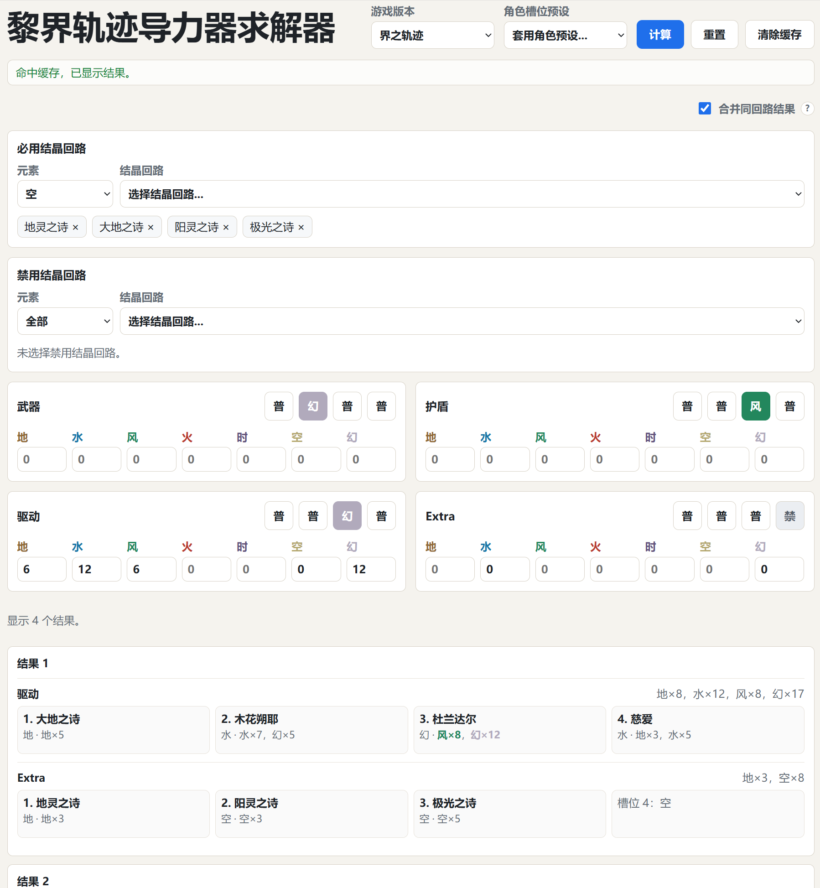

# Trails Game Orbment Solver / 黎界轨迹导力器求解器

## 简介

一个网页版导力器结晶回路求解器，支持《黎之轨迹》、《黎之轨迹II》和《界之轨迹》。求解器会在 `武器`、`护盾`、`驱动`、`Extra` 四条线路中搜索合法的结晶回路配置。

### 功能

- 选择游戏数据：`kuro`、`kuro2` 或 `kai`。
- 选择角色槽位预设。
- 为每条线路设置元素值需求。
- 指定必选或禁用的结晶回路。
- 自动搜索可能的回路配法。

### 数据文件

- 结晶回路数据：`kuro-quartz.csv`、`kuro2-quartz.csv`、`kai-quartz.csv`
- 槽位预设：`kuro-slot-profiles.json`、`kuro2-slot-profiles.json`、`kai-slot-profiles.json`
- 求解规则：`RULES.md`

结晶回路 CSV 使用制表符分隔：

```text
名称	元素	元素值
魔防2	水	水×4
三月兔	空	空×5，风×3
```

## Trails Game Orbment Solver

A browser-based orbment quartz solver for *Trails through Daybreak*, *Trails through Daybreak II*, and *Trails Beyond the Horizon*. It searches valid quartz layouts across four lines: `武器`, `护盾`, `驱动`, and `Extra`.

### Usage

- Select game data: `kuro`, `kuro2`, or `kai`.
- Load character slot presets.
- Set elemental requirements per line.
- Mark quartz as mandatory or excluded.
- Automatically search for possible quartz layout.

### Data Files

- Quartz data: `kuro-quartz.csv`, `kuro2-quartz.csv`, `kai-quartz.csv`
- Slot presets: `kuro-slot-profiles.json`, `kuro2-slot-profiles.json`, `kai-slot-profiles.json`
- Solver rules: `RULES.md`

Quartz CSV rows are tab-separated:

```text
name	element	values
魔防2	水	水×4
三月兔	空	空×5，风×3
```
